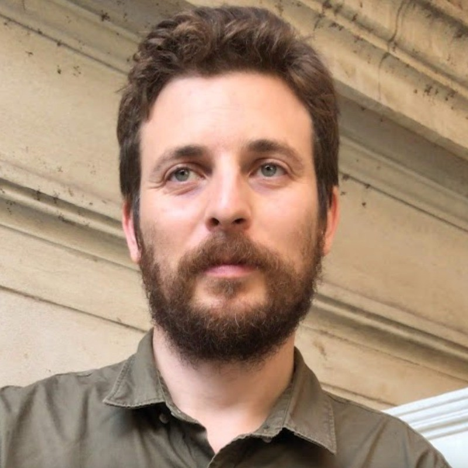

## Christian Karl Delhey - Senior Front-End Developer

**Greetings!** I'm Christian Karl Delhey, a Senior Front-End Developer with 8+ years of experience building scalable web and mobile interfaces. Currently based in Barcelona, Spain, I specialize in Vue 3 (Composition API, Pinia) and TypeScript, with strong React and React Native experience.

## Skills and Expertise

I specialize in modern frontend development with a focus on:

- **Frontend Core:** JavaScript (ES6+), TypeScript, HTML5, CSS3
- **Frameworks:** Vue 3 (Composition API, Pinia), Vue 2, React, React Native
- **Real-Time & APIs:** Socket.IO, WebSockets, REST APIs, YouTube Data API
- **Backend & Databases:** Node.js, Express, MongoDB, PHP, Laravel (basic)
- **Testing & Tooling:** Jest, Vitest, Git, Docker, Jenkins
- **AI-Augmented Development:** Claude, Windsurf, MCP integrations, agentic coding workflows

## Professional Experience

### Formación Ninja · Barcelona, Spain
**Senior Frontend Developer (May 2025 – October 2025)**
Led frontend development of a React Native mobile app for Spanish civil service exam preparation. Built UX-focused features including practice tests, progress tracking, and user onboarding flows.

### Stensul · Buenos Aires / New York (Remote)
**Frontend Developer (January 2020 – March 2025)**
- Led migration from Vue 2 (Options API) to Vue 3 (Composition API), improving performance and maintainability
- Implemented a new design system across multiple application sections
- Owned and maintained the frontend XSS filtering system
- Collaborated closely with QA, Product, and Design teams

### Ministerio de Producción · Buenos Aires
**Frontend Developer (December 2016 – January 2020)**
Built and maintained React-based web applications and accessible pages to support digital transformation for Argentine small industries.

## Personal Projects

I actively build full-stack personal projects to explore new technologies:

- **Hasen:** Real-Time Multiplayer Card Game (Vue 3, TypeScript, Socket.IO, Node.js, MongoDB)
- **Youtravel:** YouTube Travel Map - Geotagged Video Explorer (Vue 3, YouTube Data API, Interactive Maps)

## Continuous Learning

The dynamic nature of the tech industry inspires me to stay up-to-date with the latest trends. I'm particularly interested in real-time architecture, geospatial APIs, and AI-augmented development workflows.

## Get in Touch

**Location:** Barcelona, Spain
**Email:** caascaas@gmail.com
**Phone:** +34 658 028 828
**LinkedIn:** [View Profile](https://linkedin.com/in/christiankarldelhey)
**GitHub:** [View Profile](https://github.com/christiankarldelhey)

Feel free to reach out for collaboration, consultation, or just a friendly chat about frontend development and modern web technologies.

_Let's build something amazing together!_
