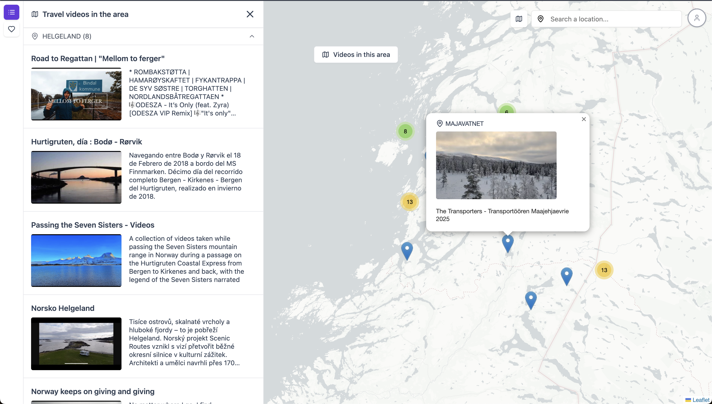

<!--  -->
Vue 3
YouTube Data API
Leaflet.js
Browser Geolocation API
Vue 3 Reactivity

**Project Overview:**
Youtravel is a web application that searches for geotagged YouTube travel videos and displays them on an interactive map. Users can explore travel content spatially, save favorite videos, and plan trips using video content as inspiration.

## Objectives

1. Create an interactive map interface for travel video discovery
2. Integrate YouTube Data API for video search
3. Implement geospatial visualization of video content
4. Build a favorites system for trip planning

## Features

1. **YouTube Data API Integration:**

- Search for geotagged travel videos
- Extract location data from video metadata
- Handle API rate limiting and error cases

2. **Interactive Map Visualization:**

- Using Leaflet.js for the interactive map component
- Custom markers for each video location
- Clustering for dense video areas
- Filter by location or video category

3. **Geolocation Challenges & Solutions:**

- Video description parsing for location mentions
- Tag analysis as location hints
- User-submitted locations for manual pinning
- Fallback strategies for videos without precise location data

4. **User Features:**

- Favorites system for trip planning
- Video preview in map popups
- Search by destination or video type
- Responsive design for mobile planning

## Technology Stack

## Live Demo

[Explore Youtravel](https://you-travel-8abc8.web.app)

## Source Code

[GitHub Repository](https://github.com/christiankarldelhey/youtubeproject)

## Development Journey

This project serves as a gateway into GIS-oriented web development, combining video content with spatial visualization. The main challenge was working with YouTube's limited geolocation data and developing creative solutions to extract location information from various metadata sources.

## Technical Challenges

1. **Geolocation Data Extraction:** YouTube doesn't always provide precise geolocation data in video metadata, requiring creative parsing strategies

2. **API Rate Limiting:** Managing YouTube Data API quotas while providing a smooth user experience

3. **Map Performance:** Optimizing map rendering with multiple markers and clusters

## Future Enhancements

- Social sharing of travel routes
- Integration with travel booking APIs
- AI-powered travel recommendations
- Mobile app version
